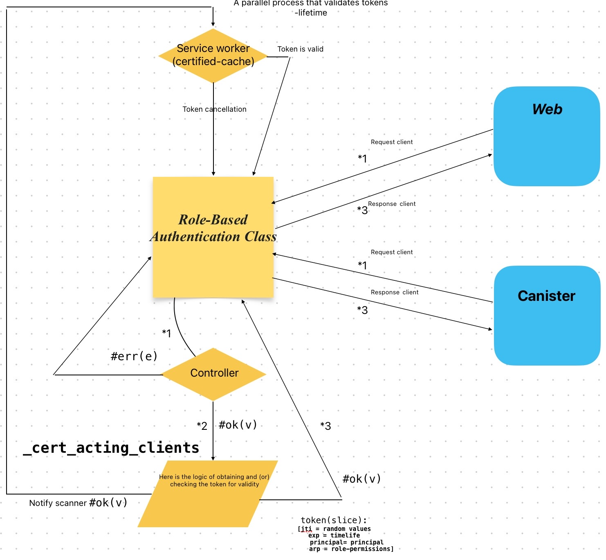

# Role-Based Authentication Class - Motoko
## Web administrator (React-Vite)
### Sample
https://gyuwx-hqaaa-aaaan-qdw2a-cai.icp0.io/

## Settings
#### Check system requirements
- [Node.js](https://nodejs.org/)
- [DFX](https://internetcomputer.org/docs/current/developer-docs/quickstart/local-quickstart) >= 0.14.3
- [Moc](https://github.com/dfinity/motoko/releases) >= 0.9.3
#### Setup MOPS
Configure this package manager
Follow the instructions
- https://mops.one/docs/install

 ```
 "defaults": {
    "build": {
      "args": "",
      "packtool": "mops sources"
    }
  }
  ```
#### Add the following lines
 ```
[dependencies]
rbac-motoko = "0.1.3"
 ```
## Source RBAC
 - https://github.com/fury02/rbac-motoko

[//]: # (![image]&#40;doc/mermaid_diagram/web_canister.svg&#41;)
## Block scheme


## Commands
    Before you start, go to the settings file frontend (src/settings.ts), change the environment and install the necessary canisters
    //Edit env
    export const NODE_ENV = 'development'
    export const NODE_ENV = 'production'
    //Edit canisters for production: 
    export const CANISTER_RBAC = 'canister_id' 
    export const CANISTER_FRONTEND = 'canister_id' 
    //Edit canisters anp replica port for development:
    export const LOCAL_REPLICA_PORT = 'xxxxx'
    export const LOCAL_URL = 'http://127.0.0.1:' + LOCAL_REPLICA_PORT
    export const LOCAL_CANISTER_RBAC = 'canister_id' 

### When deploying for the first time, it is recommended to use these commands:	
### Production (Reinstall):
    npm run remove
  	npm install
  	dfx start --clean
  	npm run setup-ic
  	dfx canister --network=ic install --mode=reinstall rbac
  	dfx canister --network=ic install --mode=reinstall frontend
    dfx canister --network=ic update-settings rbac --add-controller <canister_id>
    dfx canister --network=ic call rbac add_admin "(principal \"your principal\")"
    dfx canister --network=ic call rbac init

### When updating
### Production:

-  	<s>dfx start --clean</s>
-  	<s>npm run setup-ic</s>
- 	<s>dfx canister --network=ic install --mode=upgrade rbac</s>
-    <s>dfx canister --network=ic install --mode=reinstall frontend</s>

### Local:
	npm install
	dfx start --clean
	npm run setup
    dfx canister --network=ic update-settings rbac --add-controller <canister_id>
    dfx canister --network=ic call rbac add_admin "(principal \"your principal\")"
    dfx canister --network=ic call rbac init
	npm run start

## History
- Version: 0.1.0
- Version: 0.1.1
- Version: 0.1.2
- Version: 0.1.3

[//]: # (## In  future)

## License

MIT License

Copyright (c) 2023 fury02

Permission is hereby granted, free of charge, to any person obtaining a copy
of this software and associated documentation files (the "Software"), to deal
in the Software without restriction, including without limitation the rights
to use, copy, modify, merge, publish, distribute, sublicense, and/or sell
copies of the Software, and to permit persons to whom the Software is
furnished to do so, subject to the following conditions:

The above copyright notice and this permission notice shall be included in all
copies or substantial portions of the Software.

THE SOFTWARE IS PROVIDED "AS IS", WITHOUT WARRANTY OF ANY KIND, EXPRESS OR
IMPLIED, INCLUDING BUT NOT LIMITED TO THE WARRANTIES OF MERCHANTABILITY,
FITNESS FOR A PARTICULAR PURPOSE AND NONINFRINGEMENT. IN NO EVENT SHALL THE
AUTHORS OR COPYRIGHT HOLDERS BE LIABLE FOR ANY CLAIM, DAMAGES OR OTHER
LIABILITY, WHETHER IN AN ACTION OF CONTRACT, TORT OR OTHERWISE, ARISING FROM,
OUT OF OR IN CONNECTION WITH THE SOFTWARE OR THE USE OR OTHER DEALINGS IN THE
SOFTWARE.

## Funding
The bounty was funded by The ICDevs.org community and the DFINITY Foundation 